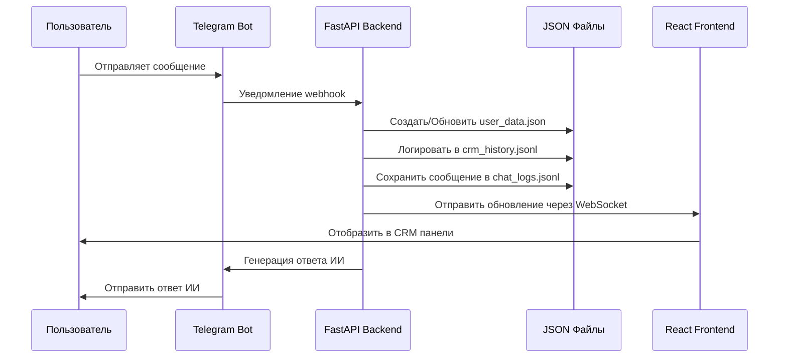
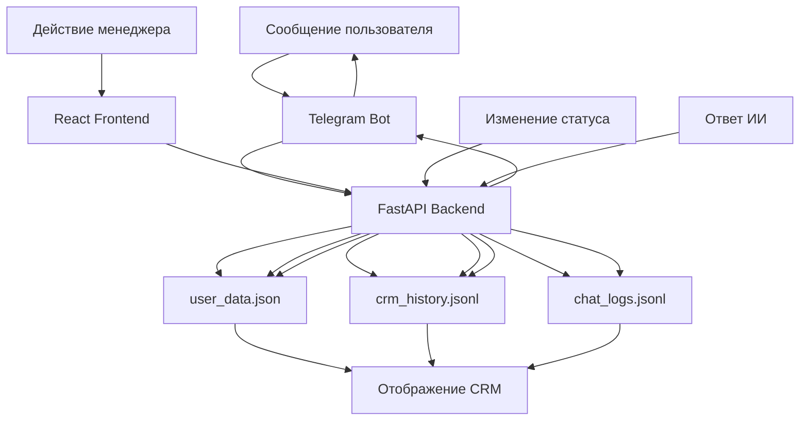
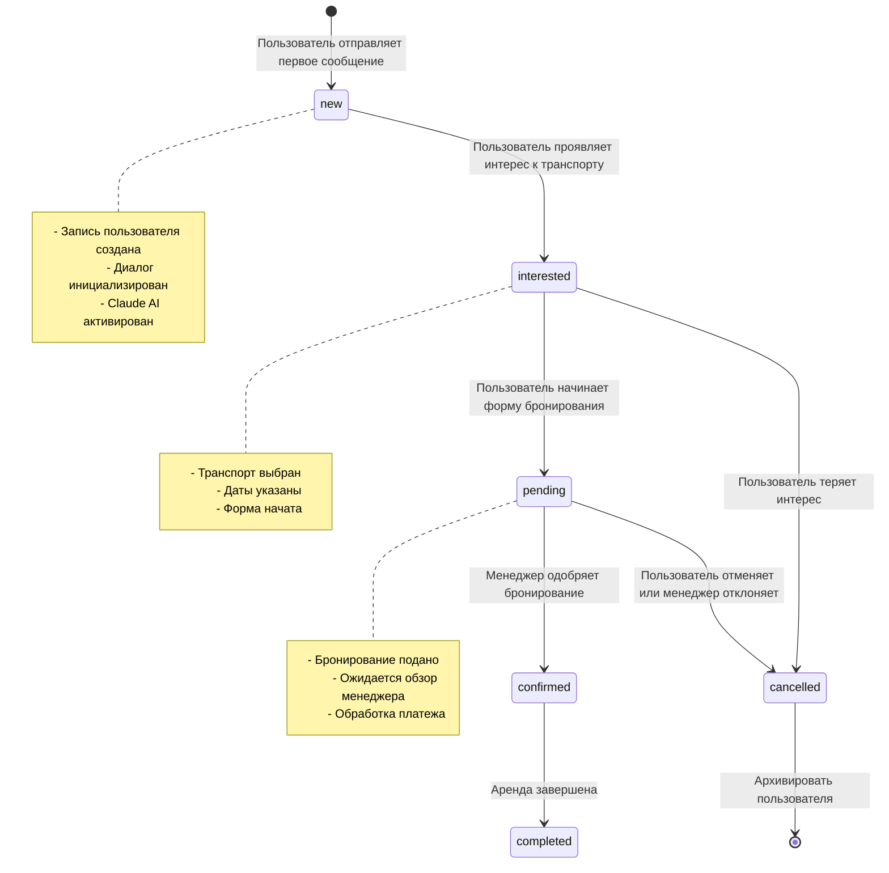

# Глобальная карта данных системы - CRM проката автомобилей

На основе комплексного анализа файлов системы CRM проката автомобилей, я создам подробное техническое описание и диаграммы по запросу.

## Этап 1: Поток "Новый пользователь"

### Что происходит, когда пользователь отправляет первое сообщение боту:

**Пошаговая логика:**

1. **Пользователь отправляет сообщение** → Telegram Bot получает через фреймворк Telebot
2. **Bot обрабатывает сообщение** → `telegram_bot.py` обрабатывает входящие обновления
3. **Создание пользователя** → `web_integration.py` создает новую запись пользователя в `user_data.json`
4. **Инициализация диалога** → Устанавливает состояние диалога и регистрирует начальное событие
5. **Ответ ИИ** → Claude AI генерирует автоматический ответ
6. **Сохранение данных** → Все действия регистрируются в `crm_history.jsonl`

**Поля, создаваемые в user_data.json:**
```json
{
  "user_id": 123456789,
  "username": "user_name",
  "created_at": "2025-01-17T10:23:36.966Z",
  "updated_at": "2025-01-17T10:23:36.966Z",
  "status": "new",
  "car_interested": null,
  "category_interested": null,
  "dates_selected": null,
  "form_started": false,
  "booking_submitted": false,
  "notes": [],
  "archived": false,
  "source": "telegram",
  "dialog": {
    "active": true,
    "has_new_messages": true,
    "last_message_at": "2025-01-17T10:23:36.966Z",
    "last_message_from": "user",
    "message_count": 1,
    "claude": {
      "enabled": true,
      "status": "active",
      "started_at": "2025-01-17T10:23:36.966Z",
      "paused_at": null
    }
  }
}
```

## Этап 2: Синхронизация данных (Bot ↔ Backend ↔ CRM)

### Как CRM узнает о новых сообщениях/изменениях статуса:

**FastAPI endpoints в web_integration.py:**
- `POST /botapi/notify/filters-used` - Получает выбор фильтров от бота
- `POST /api/leads/track` - Отслеживает события лидов и изменения статуса
- `GET /api/leads` - Обслуживает данные пользователей для фронтенда
- `POST /api/leads/{user_id}/message` - Отправляет сообщения менеджера
- `PUT /api/leads/{user_id}/status` - Обновляет статус пользователя

**Ключевые функции:**
- `update_dialog_status(user_id, **kwargs)` - Обновляет состояние диалога в реальном времени
- `log_dialog_event(user_id, action, **kwargs)` - Создает аудиторский след в crm_history.jsonl
- `notify_crm_update(user_id, event_type)` - Отправляет обновления на фронтенд через WebSocket/опрос

**Механизм синхронизации:**
1. Bot отправляет webhook в backend с действиями пользователя
2. Backend обновляет user_data.json и регистрирует в crm_history.jsonl
3. Frontend опрашивает backend API или получает WebSocket обновления
4. CRM отображает обновленную информацию в реальном времени

## Этап 3: Маппинг структуры файлов

### Схема маппинга:

**user_data.json (Управление состоянием):**
```json
{
  "user_id": "int - Первичный ключ",
  "username": "string - Имя пользователя Telegram",
  "created_at": "datetime - Время регистрации пользователя",
  "updated_at": "datetime - Время последней активности",
  "status": "enum - new|interested|pending|confirmed|cancelled",
  "car_interested": "string|null - Выбранное транспортное средство",
  "category_interested": "string|null - Категория транспортного средства",
  "dates_selected": "object|null - {start, end, days}",
  "form_started": "boolean - Начал ли пользователь форму бронирования",
  "booking_submitted": "boolean - Была ли подана заявка на бронирование",
  "notes": "array - Заметки менеджера",
  "archived": "boolean - Архивирован ли пользователь",
  "source": "enum - telegram|telegram_webapp|direct",
  "dialog": "object - Состояние разговора"
}
```

**chat_logs.jsonl (История сообщений):**
```json
{
  "timestamp": "datetime - Временная метка сообщения",
  "user_id": "int - Внешний ключ к user_data.json",
  "role": "enum - user|assistant|manager",
  "content": "string - Содержание сообщения"
}
```

**crm_history.jsonl (Регистрация событий):**
```json
{
  "timestamp": "datetime - Временная метка события",
  "user_id": "int - Внешний ключ к user_data.json",
  "action": "enum - dialog_started|booking_submitted|note_added|status_changed",
  "initiated_by": "enum - user|manager|system",
  "additional_fields": "object - Данные, специфичные для события"
}
```

**Взаимосвязи:**
- Все файлы используют `user_id` как первичный/внешний ключ
- `user_data.json` - основная запись
- `chat_logs.jsonl` ссылается на пользователей для истории разговоров
- `crm_history.jsonl` обеспечивает аудиторский след для всех действий

## Этап 4: Вмешательство менеджера

### Поток, когда менеджер отправляет сообщение из CRM панели:

**Пошаговая логика:**

1. **Менеджер печатает сообщение** → React фронтенд захватывает ввод
2. **Фронтенд отправляет в API** → `POST /api/leads/{user_id}/message`
3. **Backend обрабатывает** → Обновляет состояние диалога user_data.json
4. **Bot отправляет сообщение** → Telegram bot доставляет пользователю
5. **Логирование** → Событие записывается в crm_history.jsonl и chat_logs.jsonl
6. **Обновление статуса** → Диалог помечается как имеющий сообщения менеджера

**Поток API endpoints:**
```
CRM Frontend → FastAPI Backend → Telegram Bot → User
     ↓              ↓              ↓         ↓
user_data.json ← crm_history.jsonl ← chat_logs.jsonl
```

## Диаграммы Mermaid.js

### 1. Диаграмма последовательности (User → Bot → DB → CRM)


### 2. Диаграмма потока данных (Как обновляются файлы)


### 3. Машина состояний (Переходы статуса пользователя)


## Техническое резюме

**Архитектура системы:**
- **Микросервисы**: Telegram Bot, FastAPI Backend, React Frontend
- **Хранение данных**: Файловые JSON/JSONL с user_id как первичным ключом
- **Коммуникация**: Webhooks, REST API, WebSocket
- **Интеграция ИИ**: Claude API для автоматизированного обслуживания клиентов
- **Обновления в реальном времени**: Синхронизация состояния диалога между компонентами

**Ключевые потоки данных:**
1. **Путь пользователя**: Сообщение → Bot → Backend → Файлы → Отображение CRM
2. **Действия менеджера**: CRM → API → Bot → Пользователь → Логирование
3. **Обновления статуса**: События → Backend → Множественные файлы → Обновление UI
4. **Интеграция ИИ**: Ввод пользователя → Claude → Ответ → Пользователь

**Критические точки интеграции:**
- Webhook endpoints для коммуникации bot-backend
- REST API endpoints для обмена данными frontend-backend
- Файловое хранение с атомарными операциями записи
- Источник событий для аудиторских следов и отладки

Эта архитектура обеспечивает надежную, масштабируемую систему для управления отношениями с клиентами проката автомобилей с автоматизированной помощью ИИ и всесторонним надзором менеджеров.